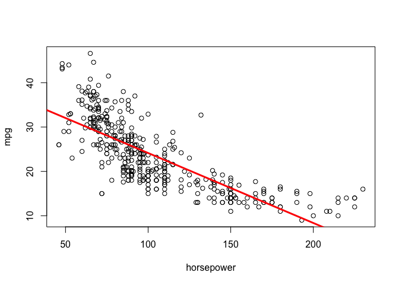
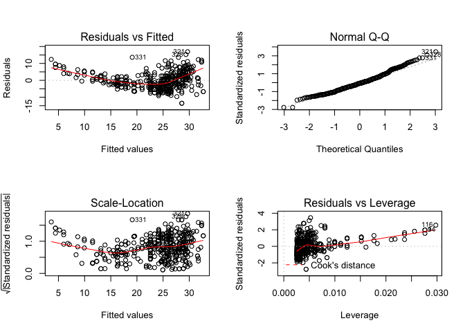
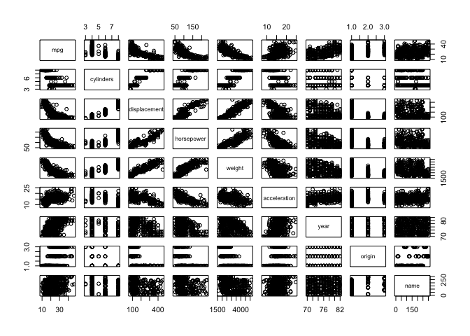
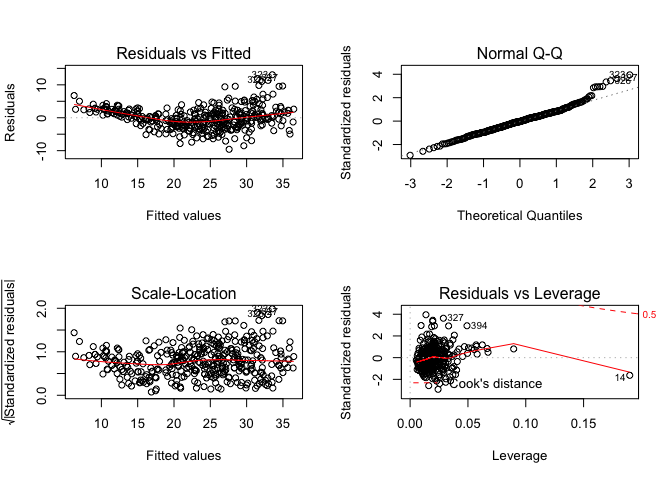
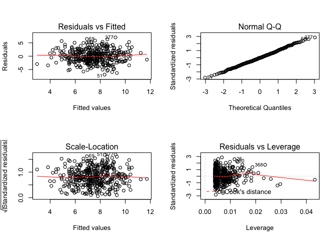

## Question 8: Simple Linear Regression on the `Auto` dataset

1. 


```r
library(ISLR)
```

```
## Warning: package 'ISLR' was built under R version 3.3.2
```

```r
attach(Auto)
lm.auto = lm(mpg~horsepower)
summary(lm.auto)
```

```
## 
## Call:
## lm(formula = mpg ~ horsepower)
## 
## Residuals:
##      Min       1Q   Median       3Q      Max 
## -13.5710  -3.2592  -0.3435   2.7630  16.9240 
## 
## Coefficients:
##              Estimate Std. Error t value Pr(>|t|)    
## (Intercept) 39.935861   0.717499   55.66   <2e-16 ***
## horsepower  -0.157845   0.006446  -24.49   <2e-16 ***
## ---
## Signif. codes:  0 '***' 0.001 '**' 0.01 '*' 0.05 '.' 0.1 ' ' 1
## 
## Residual standard error: 4.906 on 390 degrees of freedom
## Multiple R-squared:  0.6059,	Adjusted R-squared:  0.6049 
## F-statistic: 599.7 on 1 and 390 DF,  p-value: < 2.2e-16
```

According to the p-value (< 2.2e-16), there seems to be a relationship between `mpg` and `horsepower`. Looking at the R^2^ value (0.6049), the strength of the relationship appears to be average and positive.


```r
predict(lm.auto,data.frame(horsepower=98), interval="confidence")
```

```
##        fit      lwr      upr
## 1 24.46708 23.97308 24.96108
```

```r
predict(lm.auto,data.frame(horsepower=98), interval="prediction")
```

```
##        fit     lwr      upr
## 1 24.46708 14.8094 34.12476
```

2. 


```r
plot(horsepower,mpg)
abline(lm.auto,lwd=3,col="red")
```

<!-- -->

3. 


```r
par(mfrow=c(2,2))
plot(lm.auto)
```

<!-- -->

There is some evidence of non-linearity.

## Question 9: Multiple Linear Regression

1. 


```r
pairs(Auto)
```

<!-- -->

2. 


```r
cor(subset(Auto, select=-name))
```

```
##                     mpg  cylinders displacement horsepower     weight
## mpg           1.0000000 -0.7776175   -0.8051269 -0.7784268 -0.8322442
## cylinders    -0.7776175  1.0000000    0.9508233  0.8429834  0.8975273
## displacement -0.8051269  0.9508233    1.0000000  0.8972570  0.9329944
## horsepower   -0.7784268  0.8429834    0.8972570  1.0000000  0.8645377
## weight       -0.8322442  0.8975273    0.9329944  0.8645377  1.0000000
## acceleration  0.4233285 -0.5046834   -0.5438005 -0.6891955 -0.4168392
## year          0.5805410 -0.3456474   -0.3698552 -0.4163615 -0.3091199
## origin        0.5652088 -0.5689316   -0.6145351 -0.4551715 -0.5850054
##              acceleration       year     origin
## mpg             0.4233285  0.5805410  0.5652088
## cylinders      -0.5046834 -0.3456474 -0.5689316
## displacement   -0.5438005 -0.3698552 -0.6145351
## horsepower     -0.6891955 -0.4163615 -0.4551715
## weight         -0.4168392 -0.3091199 -0.5850054
## acceleration    1.0000000  0.2903161  0.2127458
## year            0.2903161  1.0000000  0.1815277
## origin          0.2127458  0.1815277  1.0000000
```

3. 


```r
lm.fit=lm(mpg~.-name,data=Auto)
summary(lm.fit)
```

```
## 
## Call:
## lm(formula = mpg ~ . - name, data = Auto)
## 
## Residuals:
##     Min      1Q  Median      3Q     Max 
## -9.5903 -2.1565 -0.1169  1.8690 13.0604 
## 
## Coefficients:
##                Estimate Std. Error t value Pr(>|t|)    
## (Intercept)  -17.218435   4.644294  -3.707  0.00024 ***
## cylinders     -0.493376   0.323282  -1.526  0.12780    
## displacement   0.019896   0.007515   2.647  0.00844 ** 
## horsepower    -0.016951   0.013787  -1.230  0.21963    
## weight        -0.006474   0.000652  -9.929  < 2e-16 ***
## acceleration   0.080576   0.098845   0.815  0.41548    
## year           0.750773   0.050973  14.729  < 2e-16 ***
## origin         1.426141   0.278136   5.127 4.67e-07 ***
## ---
## Signif. codes:  0 '***' 0.001 '**' 0.01 '*' 0.05 '.' 0.1 ' ' 1
## 
## Residual standard error: 3.328 on 384 degrees of freedom
## Multiple R-squared:  0.8215,	Adjusted R-squared:  0.8182 
## F-statistic: 252.4 on 7 and 384 DF,  p-value: < 2.2e-16
```

According to the p-value (< 2.2e-16), there seems to be a relationship between `mpg` and the other variables. It seems displacement, weight, year, and origin have relationships with `mpg`. The year variable, in particular, suggests that the older the year, the lower the mpg. As year increases, mpg increases.

4. 


```r
par(mfrow=c(2,2))
plot(lm.fit)
```

<!-- -->

There seem to be some outliers because the residual plot has a curve to it. The leverage plot does identify a point that has unusually high leverage, point 14.

5. 

By using the correlation matrix, I pulled out displacement + weight (` 0.9329944`) and cyliners + displacement (`0.9508233`) as the highest correlated variables. I used them for the interaction effects with mpg:


```r
summary(lm(mpg~displacement*weight+cylinders*displacement,data=Auto))
```

```
## 
## Call:
## lm(formula = mpg ~ displacement * weight + cylinders * displacement, 
##     data = Auto)
## 
## Residuals:
##      Min       1Q   Median       3Q      Max 
## -13.2934  -2.5184  -0.3476   1.8399  17.7723 
## 
## Coefficients:
##                          Estimate Std. Error t value Pr(>|t|)    
## (Intercept)             5.262e+01  2.237e+00  23.519  < 2e-16 ***
## displacement           -7.351e-02  1.669e-02  -4.403 1.38e-05 ***
## weight                 -9.888e-03  1.329e-03  -7.438 6.69e-13 ***
## cylinders               7.606e-01  7.669e-01   0.992    0.322    
## displacement:weight     2.128e-05  5.002e-06   4.254 2.64e-05 ***
## displacement:cylinders -2.986e-03  3.426e-03  -0.872    0.384    
## ---
## Signif. codes:  0 '***' 0.001 '**' 0.01 '*' 0.05 '.' 0.1 ' ' 1
## 
## Residual standard error: 4.103 on 386 degrees of freedom
## Multiple R-squared:  0.7272,	Adjusted R-squared:  0.7237 
## F-statistic: 205.8 on 5 and 386 DF,  p-value: < 2.2e-16
```

According to the resulting p-values, displacement and weight have an interaction effect, but displacement and cylinders do not.

6. 

Log of `mpg` and `horsepower`


```r
summary(lm(mpg~log(horsepower),data=Auto))
```

```
## 
## Call:
## lm(formula = mpg ~ log(horsepower), data = Auto)
## 
## Residuals:
##      Min       1Q   Median       3Q      Max 
## -14.2299  -2.7818  -0.2322   2.6661  15.4695 
## 
## Coefficients:
##                 Estimate Std. Error t value Pr(>|t|)    
## (Intercept)     108.6997     3.0496   35.64   <2e-16 ***
## log(horsepower) -18.5822     0.6629  -28.03   <2e-16 ***
## ---
## Signif. codes:  0 '***' 0.001 '**' 0.01 '*' 0.05 '.' 0.1 ' ' 1
## 
## Residual standard error: 4.501 on 390 degrees of freedom
## Multiple R-squared:  0.6683,	Adjusted R-squared:  0.6675 
## F-statistic: 785.9 on 1 and 390 DF,  p-value: < 2.2e-16
```

Sqrt of `mpg` and `horsepower`


```r
summary(lm(mpg~sqrt(horsepower),data=Auto))
```

```
## 
## Call:
## lm(formula = mpg ~ sqrt(horsepower), data = Auto)
## 
## Residuals:
##      Min       1Q   Median       3Q      Max 
## -13.9768  -3.2239  -0.2252   2.6881  16.1411 
## 
## Coefficients:
##                  Estimate Std. Error t value Pr(>|t|)    
## (Intercept)        58.705      1.349   43.52   <2e-16 ***
## sqrt(horsepower)   -3.503      0.132  -26.54   <2e-16 ***
## ---
## Signif. codes:  0 '***' 0.001 '**' 0.01 '*' 0.05 '.' 0.1 ' ' 1
## 
## Residual standard error: 4.665 on 390 degrees of freedom
## Multiple R-squared:  0.6437,	Adjusted R-squared:  0.6428 
## F-statistic: 704.6 on 1 and 390 DF,  p-value: < 2.2e-16
```

Sqaured of `mpg` and `horsepower`


```r
summary(lm(mpg~I(horsepower^2),data=Auto))
```

```
## 
## Call:
## lm(formula = mpg ~ I(horsepower^2), data = Auto)
## 
## Residuals:
##     Min      1Q  Median      3Q     Max 
## -12.529  -3.798  -1.049   3.240  18.528 
## 
## Coefficients:
##                   Estimate Std. Error t value Pr(>|t|)    
## (Intercept)      3.047e+01  4.466e-01   68.22   <2e-16 ***
## I(horsepower^2) -5.665e-04  2.827e-05  -20.04   <2e-16 ***
## ---
## Signif. codes:  0 '***' 0.001 '**' 0.01 '*' 0.05 '.' 0.1 ' ' 1
## 
## Residual standard error: 5.485 on 390 degrees of freedom
## Multiple R-squared:  0.5074,	Adjusted R-squared:  0.5061 
## F-statistic: 401.7 on 1 and 390 DF,  p-value: < 2.2e-16
```

Looking at the R^2^ statistic, the strongest relationship occurred with the log transformation.

## Question 10: `Carseats` dataset

1. 


```r
library(ISLR)
attach(Carseats)
lm.car=lm(Sales~Price+Urban+US,data=Carseats)
summary(lm.car)
```

```
## 
## Call:
## lm(formula = Sales ~ Price + Urban + US, data = Carseats)
## 
## Residuals:
##     Min      1Q  Median      3Q     Max 
## -6.9206 -1.6220 -0.0564  1.5786  7.0581 
## 
## Coefficients:
##              Estimate Std. Error t value Pr(>|t|)    
## (Intercept) 13.043469   0.651012  20.036  < 2e-16 ***
## Price       -0.054459   0.005242 -10.389  < 2e-16 ***
## UrbanYes    -0.021916   0.271650  -0.081    0.936    
## USYes        1.200573   0.259042   4.635 4.86e-06 ***
## ---
## Signif. codes:  0 '***' 0.001 '**' 0.01 '*' 0.05 '.' 0.1 ' ' 1
## 
## Residual standard error: 2.472 on 396 degrees of freedom
## Multiple R-squared:  0.2393,	Adjusted R-squared:  0.2335 
## F-statistic: 41.52 on 3 and 396 DF,  p-value: < 2.2e-16
```

2. 

Looking at the coefficients' p-values, it appears `Price` has a relationship with `Sales`. When `Price` is lower, `Sales` increases. It also appears `US` has a relationship with `Sales`. When the carseat is from the US, it looks like `Sales` increase.

3. 

`Sales` = $\beta$~0~ + $\beta$~1~`Price` + $\beta$~2~`Urban` + $\beta$~3~`US` + $\epsilon$

4. 

We can reject the null hypothesis for `Price` and `US`.

5. 


```r
lm.car2=lm(Sales~Price+US,data=Carseats)
summary(lm.car2)
```

```
## 
## Call:
## lm(formula = Sales ~ Price + US, data = Carseats)
## 
## Residuals:
##     Min      1Q  Median      3Q     Max 
## -6.9269 -1.6286 -0.0574  1.5766  7.0515 
## 
## Coefficients:
##             Estimate Std. Error t value Pr(>|t|)    
## (Intercept) 13.03079    0.63098  20.652  < 2e-16 ***
## Price       -0.05448    0.00523 -10.416  < 2e-16 ***
## USYes        1.19964    0.25846   4.641 4.71e-06 ***
## ---
## Signif. codes:  0 '***' 0.001 '**' 0.01 '*' 0.05 '.' 0.1 ' ' 1
## 
## Residual standard error: 2.469 on 397 degrees of freedom
## Multiple R-squared:  0.2393,	Adjusted R-squared:  0.2354 
## F-statistic: 62.43 on 2 and 397 DF,  p-value: < 2.2e-16
```

6. 

Looking at the ressidual standard error, it seems the second model only using `Price` and `US` fits the data slightly better.

7. 


```r
confint(lm.car2)
```

```
##                   2.5 %      97.5 %
## (Intercept) 11.79032020 14.27126531
## Price       -0.06475984 -0.04419543
## USYes        0.69151957  1.70776632
```

8. 


```r
par(mfrow=c(2,2))
plot(lm.car2)
```

<!-- -->

Looking at the residual plot, there seems to be evidence of linearity, which means a least squares fit could be effective. The leverage plot identified point 368 as a high leverage point.

------------------------------------------------------------

## Collaboration Exercises

### Question 11: T-Statistic


```r
set.seed(1)
x=rnorm(100)
y=2*x+rnorm(100)
```

1. 


```r
lm.xy = lm(y~x+0)
summary(lm.xy)
```

```
## 
## Call:
## lm(formula = y ~ x + 0)
## 
## Residuals:
##     Min      1Q  Median      3Q     Max 
## -1.9154 -0.6472 -0.1771  0.5056  2.3109 
## 
## Coefficients:
##   Estimate Std. Error t value Pr(>|t|)    
## x   1.9939     0.1065   18.73   <2e-16 ***
## ---
## Signif. codes:  0 '***' 0.001 '**' 0.01 '*' 0.05 '.' 0.1 ' ' 1
## 
## Residual standard error: 0.9586 on 99 degrees of freedom
## Multiple R-squared:  0.7798,	Adjusted R-squared:  0.7776 
## F-statistic: 350.7 on 1 and 99 DF,  p-value: < 2.2e-16
```

The coefficient estimate: 1.9939
Standard error of this coefficient estimate: 0.1065
T-Statistic: 18.73
P-Value: <2e-16

Since the P-Value from the T-Statistic is nearly 0, we can safely reject the null hypothesis.

2. 


```r
lm.yx = lm(x~y+0)
summary(lm.yx)
```

```
## 
## Call:
## lm(formula = x ~ y + 0)
## 
## Residuals:
##     Min      1Q  Median      3Q     Max 
## -0.8699 -0.2368  0.1030  0.2858  0.8938 
## 
## Coefficients:
##   Estimate Std. Error t value Pr(>|t|)    
## y  0.39111    0.02089   18.73   <2e-16 ***
## ---
## Signif. codes:  0 '***' 0.001 '**' 0.01 '*' 0.05 '.' 0.1 ' ' 1
## 
## Residual standard error: 0.4246 on 99 degrees of freedom
## Multiple R-squared:  0.7798,	Adjusted R-squared:  0.7776 
## F-statistic: 350.7 on 1 and 99 DF,  p-value: < 2.2e-16
```

The coefficient estimate: 0.39111
Standard error of this coefficient estimate: 0.02089
T-Statistic: 18.73
P-Value: <2e-16

3. The results from the linear regression of y onto x show the same T-Statistic and P-Value as the linear regression of x onto y. Expectedley, the coefficient estimate and the standard error of that estimate are different between the two regression analyses.

4. 


```r
n=100
((sqrt(n-1))*sum(x*y)) / (sqrt(sum(x*x) * sum(y*y)-sum(x*y)^2))
```

```
## [1] 18.72593
```

This is same as the T-Statistic reported above.

5. Algebraically, you can see that every time x and y interact in the equation, they are being multiplied, so if you switch them, you should get the same result.

6. 


```r
lm.xy_intercept = lm(y~x)
summary(lm.xy_intercept)
```

```
## 
## Call:
## lm(formula = y ~ x)
## 
## Residuals:
##     Min      1Q  Median      3Q     Max 
## -1.8768 -0.6138 -0.1395  0.5394  2.3462 
## 
## Coefficients:
##             Estimate Std. Error t value Pr(>|t|)    
## (Intercept) -0.03769    0.09699  -0.389    0.698    
## x            1.99894    0.10773  18.556   <2e-16 ***
## ---
## Signif. codes:  0 '***' 0.001 '**' 0.01 '*' 0.05 '.' 0.1 ' ' 1
## 
## Residual standard error: 0.9628 on 98 degrees of freedom
## Multiple R-squared:  0.7784,	Adjusted R-squared:  0.7762 
## F-statistic: 344.3 on 1 and 98 DF,  p-value: < 2.2e-16
```

```r
lm.yx_intercept = lm(x~y)
summary(lm.yx_intercept)
```

```
## 
## Call:
## lm(formula = x ~ y)
## 
## Residuals:
##      Min       1Q   Median       3Q      Max 
## -0.90848 -0.28101  0.06274  0.24570  0.85736 
## 
## Coefficients:
##             Estimate Std. Error t value Pr(>|t|)    
## (Intercept)  0.03880    0.04266    0.91    0.365    
## y            0.38942    0.02099   18.56   <2e-16 ***
## ---
## Signif. codes:  0 '***' 0.001 '**' 0.01 '*' 0.05 '.' 0.1 ' ' 1
## 
## Residual standard error: 0.4249 on 98 degrees of freedom
## Multiple R-squared:  0.7784,	Adjusted R-squared:  0.7762 
## F-statistic: 344.3 on 1 and 98 DF,  p-value: < 2.2e-16
```

Again, as you can see in the summary of each regression, the T-Statistic is the same for both y onto x and x onto y.

### Question 14: Colinearity 
