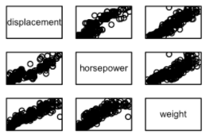

```{r setup, include=FALSE}
knitr::opts_chunk$set(echo = TRUE)
```

# Conceptual Exercise

## 5. Consider two curves, 

$g^1$ and $g^2$, defined by

$$\hat{g_1} = argmin_g(\sum_{i=1}^{n}(y_i - g(x_i))^2 + \lambda\int[g^{(3)}(x)]^2dx)$$
$$\hat{g_2} = argmin_g(\sum_{i=1}^{n}(y_i - g(x_i))^2 + \lambda\int[g^{(4)}(x)]^2dx)$$
where $g^{(m)}$ represents the $m$th derivative of $g$.

### (a) As 
$\lambda → \infty$, will $g^1$ or $g^2$ have the smaller training RSS?

The $\lambda$ controls the bias-variance trade-off in a smoothing spline. As lambda decreases, the spline will exactly fit the training data. Therefore, lower values of $\lambda$ create a more flexible model with higher variance and lower bias because there is less of an effect on the loss function $g$. A more intermediate value will choose the appropriate training observations while also not performing terribly on the test data. However, in this case, we are comparing the third derivative in the penalty term to the fourth derivative in the penalty term.

However, the third derivative will make the function stay continuous, but the fourth derivative will cause the tuning parameter to become zero. As aforementioned, if the tuning parameter is zero, then the loss function $g$ will be allowed to perfectly fit to the training observations. Therefore, $g^2$ will have a lower training RSS.

### (b) As 
$\lambda → \infty$, will $g^1$ or $g^2$ have the smaller test RSS?

Similarly, because the tuning parameter controls the loss function from overfitting the data, $g^1$ will have a smaller test RSS.

### (c)  As 
$\lambda → 0$, will $g^1$ or $g^2$ have the smaller training and test RSS?

However, when the tuning parameter becomes zero, then the difference between $g^1$ and $g^2$ doesn't matter. The entire penalty term goes to zero in both cases, causing the test RSS to be larger than the training RSS in both cases since the loss function is allowed to overfit the data.

# Applied Exercise

## 8. Fit some of the non-linear models investigated in this chapter to the `Auto` data set. Is there evidence for non-linear relationships in this data set? Create some informative plots to justify your answer.

We first want to get a feel for the data, so we'll do a summary and then a pairs scatterplot matrix.

```{r}
library(ISLR)
attach(Auto)
summary(Auto)
```

```{r}
pairs(Auto)
```

From this, it appears displacement, horsepower, and weight have apparent relationships. Here is a closer look at what I'm seeing:



They also seem to do well when paired with mpg, which is the response variable I will be trying to predict:


Therefore, I'm going to focus on these three variables when fitting some non-linear models to predict mpg. Before I start testing out models, I'm going to split the data into a training set and a test set.

```{r}
set.seed(1)
train <- sample(dim(Auto)[1], dim(Auto)[1]/2)
Auto.train <- Auto[train,]
Auto.test <- Auto[-train,]
mpg.test <- mpg[-train]
```

*Polynomial regression*

I'll try to graph the model of a fourth-degree polynomial to predict mpg using weight.

```{r}
fit <- lm(mpg~poly(weight,4,raw=T),data=Auto.train)
coef(summary(fit))
```
```{r}
weightlims <- range(weight)
weight.grid <- seq(from=weightlims[1],to=weightlims[2])
preds <- predict(fit,newdata=list(weight=weight.grid),se=TRUE)
se.bands <- cbind(preds$fit+2*preds$se.fit,preds$fit-2*preds$se.fit)
par(mfrow=c(1,2),mar=c(4.5,4.5,1,1),oma=c(0,0,4,0))
plot(weight,mpg,xlim=weightlims,cex=.5,col="darkgrey")
title("Degree-4 Polynomial",outer=T)
lines(weight.grid,preds$fit,lwd=2,col="blue")
matlines(weight.grid,se.bands,lwd=1,col="blue",lty=3)
```

As we would expect, when fitting a fourth degree polynomial, the "tail starts to wag" at the ends. Yet, at face-value, it does seem like a nice fit. However, when working with polynomial regression, we need to find the optimal degree polynomial. While there are multiple methods to do this (such as cross validation), I'll do it with an Anova test.

```{r}
fit.1<-lm(mpg~weight,data=Auto.train)
fit.2<-lm(mpg~poly(weight,2),data=Auto.train)
fit.3<-lm(mpg~poly(weight,3),data=Auto.train)
fit.4<-lm(mpg~poly(weight,4),data=Auto.train)
anova(fit.1,fit.2,fit.3,fit.4)
```

In this case, the p-value comparing Model 1 and Model 2 is too small and the p-values comparing Model 2 to Model 3 and Model 3 to Model 4 are too large. Instead, I'll change the predictor to displacement rather than weight.

```{r}
fit.1<-lm(mpg~displacement,data=Auto.train)
fit.2<-lm(mpg~poly(displacement,2),data=Auto.train)
fit.3<-lm(mpg~poly(displacement,3),data=Auto.train)
fit.4<-lm(mpg~poly(displacement,4),data=Auto.train)
anova(fit.1,fit.2,fit.3,fit.4)
```

I'm seeing the same problem here. Now, I'm going to try horsepower.

```{r}
fit.1<-lm(mpg~horsepower,data=Auto.train)
fit.2<-lm(mpg~poly(horsepower,2),data=Auto.train)
fit.3<-lm(mpg~poly(horsepower,3),data=Auto.train)
fit.4<-lm(mpg~poly(horsepower,4),data=Auto.train)
anova(fit.1,fit.2,fit.3,fit.4)
```

Nope. OK, I'm going to try and combine the predictors.

```{r}
fit.1<-lm(mpg~displacement+horsepower,data=Auto.train)
fit.2<-lm(mpg~displacement+poly(horsepower,2),data=Auto.train)
fit.3<-lm(mpg~displacement+poly(horsepower,3),data=Auto.train)
fit.4<-lm(mpg~displacement+poly(horsepower,4),data=Auto.train)
anova(fit.1,fit.2,fit.3,fit.4)
```

Getting closer. What if I do weight instead of displacement and then swap it in the equation with horsepower?

```{r}
fit.1<-lm(mpg~horsepower+weight,data=Auto.train)
fit.2<-lm(mpg~horsepower+poly(weight,2),data=Auto.train)
fit.3<-lm(mpg~horsepower+poly(weight,3),data=Auto.train)
fit.4<-lm(mpg~horsepower+poly(weight,4),data=Auto.train)
anova(fit.1,fit.2,fit.3,fit.4)
```

Yay! It looks like the p-value of 3% comparing Model 3 and Model 4 could be optimal here. Now, I'm going to re-fit the model using these predictors and a fourth degree polynomial.

```{r}
fit.poly <- lm(mpg~horsepower+poly(weight,4,raw=T),data=Auto, subset=train)
coef(summary(fit))

poly.pred <- predict(fit.poly,newx=Auto.test)
mean((poly.pred-mpg.test)^2)
```

So, using this Degree-4 model, it seems the test error is 87.138.

Now, I'm going to try out step functions. Unlike the polynomial regression above, I'm going to instead use cross validation to choose the number of cuts (some help from Jennifer's code here).

```{r}
library(boot)
reps <- 15
cv_errors <- rep(NA, reps)

for (i in 2:reps+1) {
  Auto$horsepower_cut <- cut(horsepower, i)
  Auto$weight_cut <- cut(weight, i)
  #Auto$horsepower_cut <- Auto$horsepower_cut[,drop=TRUE]
  #Auto$weight_cut <- Auto$weight_cut[,drop=TRUE]
  fit.step <- glm(mpg ~ horsepower_cut+weight_cut, data=Auto)
  cv_errors[i] <- cv.glm(Auto, fit.step, K=10)$delta[1]
}

plot(cv_errors, type="b")
which.min(cv_errors)
```

It seems like eight cuts in this case works best. With that said, I'm now going to calculate the test error.

```{r}
Auto$horsepower_cut <- cut(horsepower[train], 8)
Auto$weight_cut <- cut(weight[train], 8)
fit.step <- glm(mpg ~ horsepower_cut+weight_cut, data=Auto, subset=train)

step.pred <- predict(fit.step,newx=Auto.test)
mean((step.pred-mpg.test)^2)
```

Ah! The test error is way lower here. Ok, seems like the step function is winning now. Let's try splines.

First, a cubic spline.

```{r}
library(splines)
weightlims <- range(weight)
weight.grid <- seq(from=weightlims[1],to=weightlims[2])
horselims <- range(horsepower)
horsepower.grid <- seq(from=horselims[1],to=horselims[2])
fit.splines<-lm(mpg~bs(horsepower+weight,knots<-c(45,110,160)),data=Auto, subset=train)
splines.pred<-predict(fit.splines,newx=Auto.test,se=T)
mean((splines.pred$fit-mpg.test)^2)
```

Natural Spline

```{r}
fit.ns<-lm(mpg~ns(horsepower+weight,df=4),data=Auto,subset=train)
ns.pred<-predict(fit.ns,newdata=Auto.train,se=T)
mean((ns.pred$fit-mpg.test)^2)
```

Smoothing Spline

```{r}
fit.ss<-smooth.spline(horsepower[train]+weight[train],mpg[train],cv=TRUE)
ss.pred<-predict(fit.ss,newdata=Auto.train,deriv=2)
mean((ss.pred$y-mpg.test)^2)
```

While I have a feeling something went awry with the smoothing spline, it seems the natural spline has the lowest test error. However, it's not as low as the step function. It could potentially be improved by doing cross validation for the degrees of freedom value.

```{r}
library(gam)
fit.lr<-loess(mpg~weight+horsepower,data=Auto, subset=train)
lr.pred<-predict(fit.lr,newdata=Auto.test)
mean((na.omit(unname((lr.pred)))-mpg.test)^2)
```

This test error is still not an improvement on the step function.

And last, but certainly not least, GAMs:
```{r}
library(gam)
fit.gam<-gam(mpg~s(weight,4)+s(horsepower,5)+displacement,data=Auto, subset=train)
gam.pred<-predict(fit.gam,newdata=Auto.test)
gam.pred
mean((gam.pred-mpg.test)^2)
```
In this case, it seems the GAM's test error is the lowest; however, this may be because I added in displacement.
